# Krabby Demo Clients

This [monorepo] repository contains all Front-ends/clients for demo-ing integrations of the different Krabby real-time services implementations.

> As is the case with all Krabby implementations, the `audio` and `video` call functionalities are the core focus. But for extra enhancements, each demo will feature a robust chat application experience that matches those on platforms like WhatsApp, Telegram and more.

## Main Demo Directories

- `web`: For all web-based demos.

  Currently available builds.

    1. [Raw Krabby chat API integrations demo with `NextJs`](./web/apps/nextjs__raw_krabby_chat_api_integrations).

       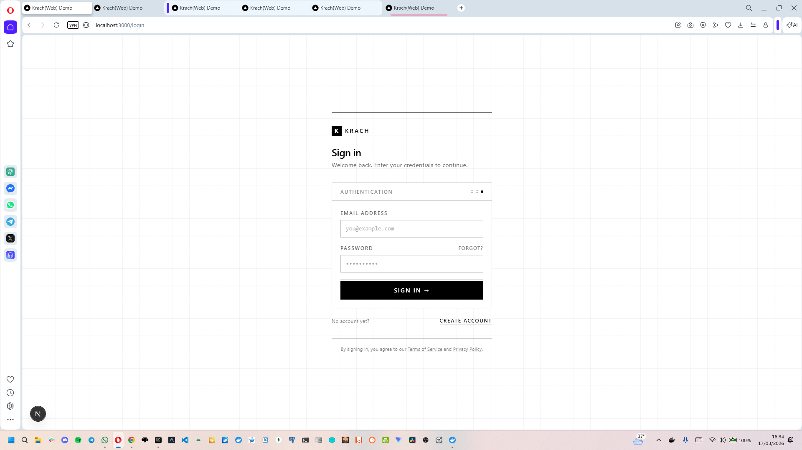
    
       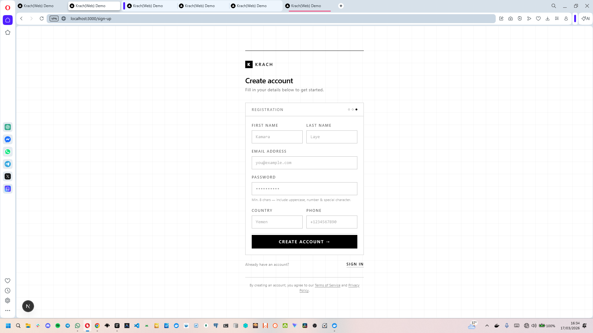
    
       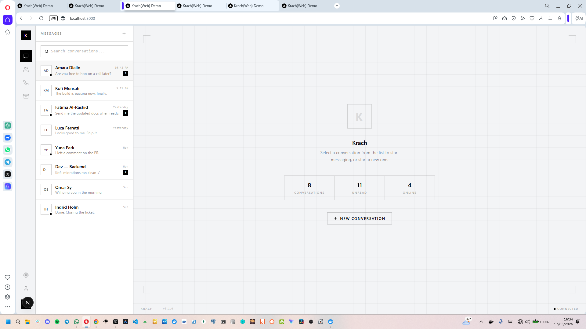
    
       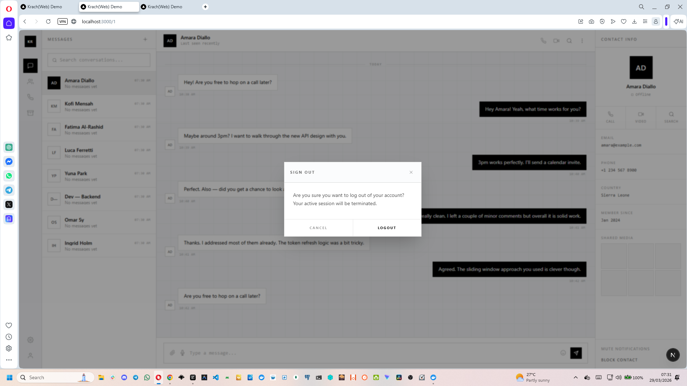
    
       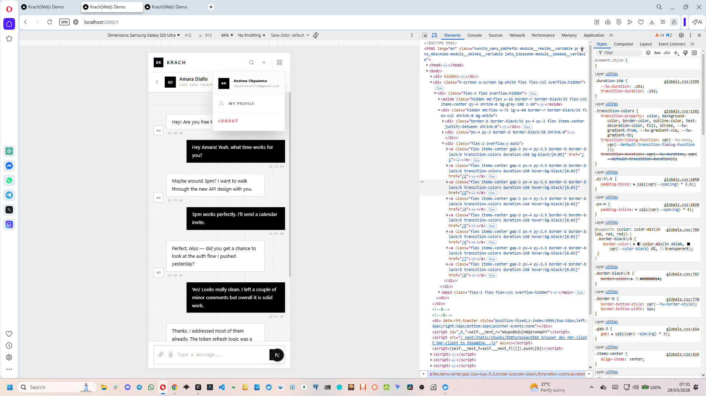
    
       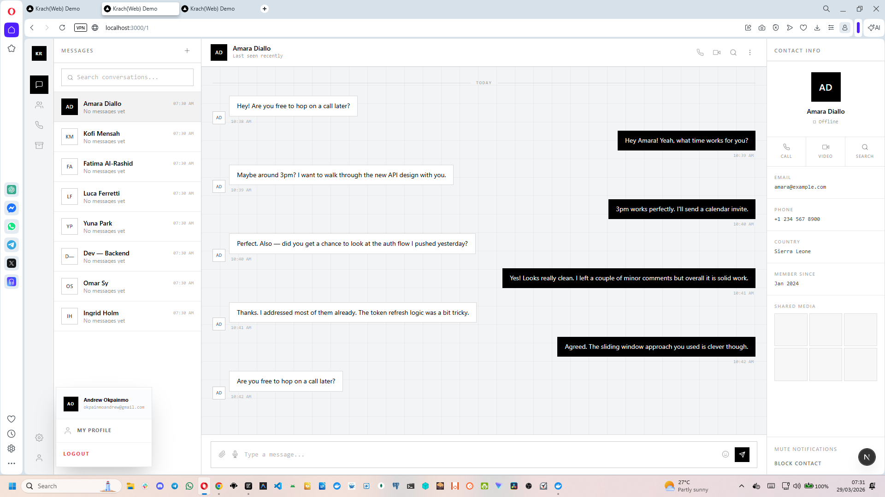
 
       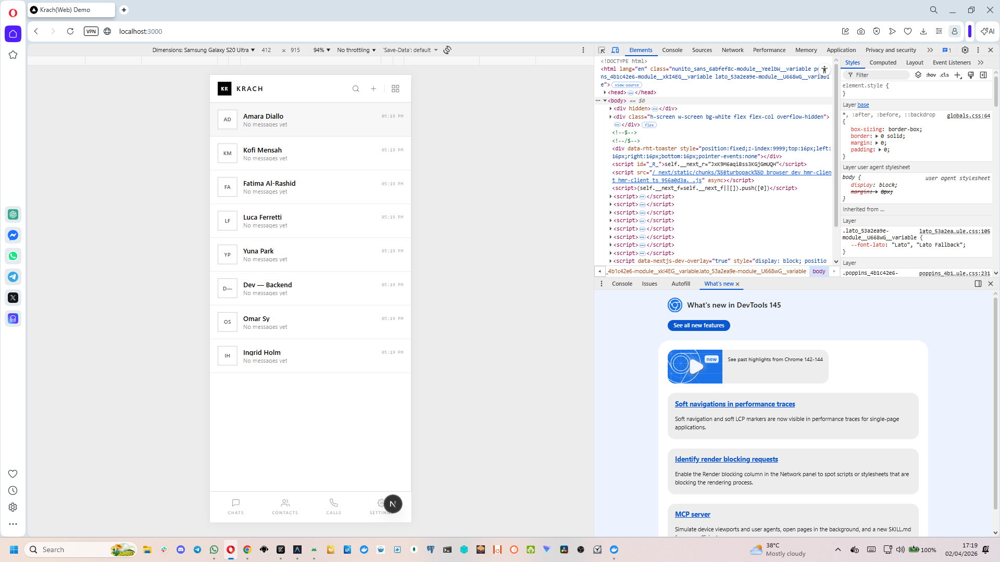
    
       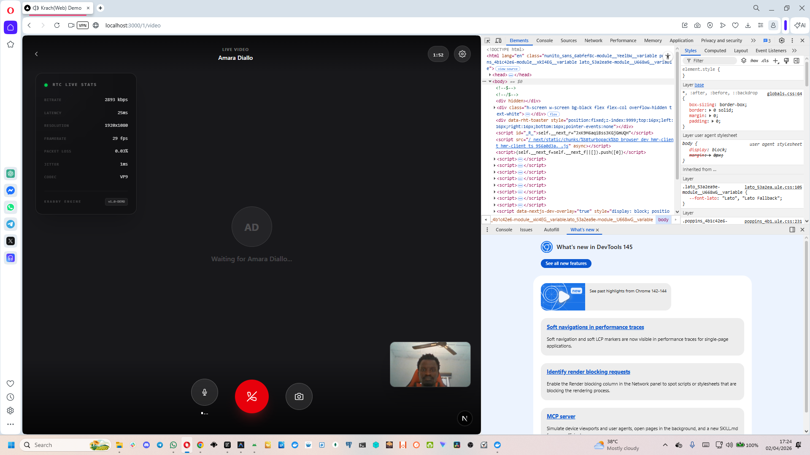
    
       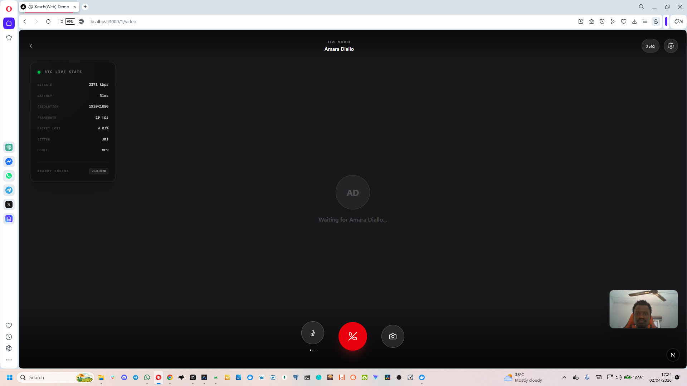

       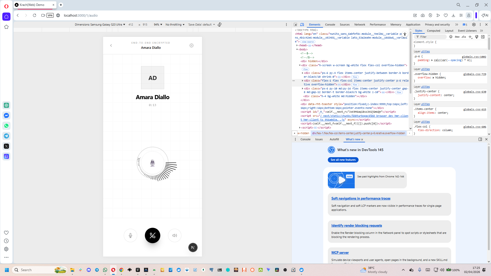

       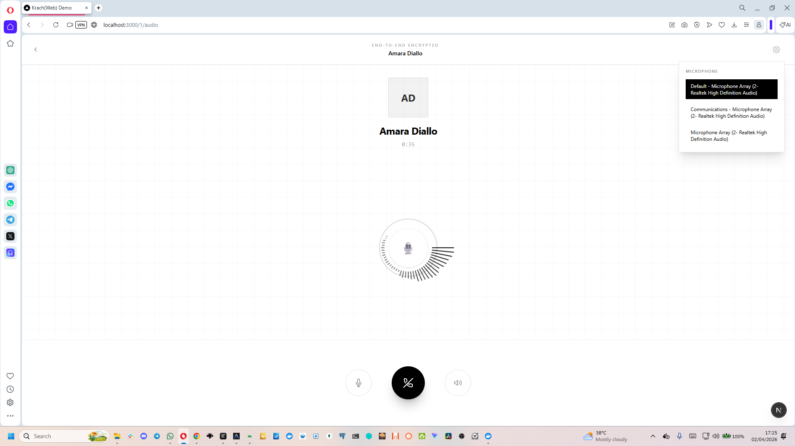

    2. ...
    3. ...
    
- `desktop`: For all desktop applications demos (in view).

  Currently available builds.

    1. ...
    2. ...
    3. ...
    
- `mobile`: For all mobile applications (in view)

  Currently available builds.
  
    1. ...
    2. ...
    3. ...

## Getting Started

To get started with any of the demo clients:

1. Clone this repository.
2. Navigate to the desired client category (e.g., `web/apps`).
3. Then Follow the specific instructions in each app's `README.md`.

## Data Modelling Reference

The project contains an SQL reference to the complete `Krabby chat API`. The SQL reference is defined in the following SQL schema file:

- [`/docs/reference/data_model/schema.sql`](./docs/reference/data_model/schema.sql)

This schema is to serve as a guide/helper for structuring client/front-end data. E.g. within Redux Toolkit slices and for other client-side state management chores. Please refer to it to ensure type safety and consistency.

## Continuous Integration (CI)

This project has a CI setup configured via GitHub Actions. If you fork the repository and want to verify the CI builds on your fork, you may need to add repository secrets to your fork's settings if any tests or deployment flows require them.

### How to Add Secrets to Your GitHub Fork:

1.  Navigate to your fork of the repository on GitHub.
2.  Click on the **Settings** tab at the top.
3.  In the left sidebar, click on **Secrets and variables** and then select **Actions**.
4.  Click the **New repository secret** button.
5.  Enter the secret **Name** and its corresponding **Value**.
6.  Click **Add secret**.
7.  Repeat this process for all required secrets.

## Contributing

Contributions are what make the open-source community such an incredible place to learn, inspire, and create. Any contributions you make are **greatly appreciated**.

Please check our [Contributing Guidelines](CONTRIBUTING.md) to get started.

### Code of Conduct

We are committed to providing a friendly, safe and welcoming environment for all. Please see our [Code of Conduct](CODE_OF_CONDUCT.md).

## Security

If you discover any security-related issues, please refer to our [Security Policy](SECURITY.md) instead of using the issue tracker.

## License

This project is licensed under the MIT License - see the [LICENSE](LICENSE) file for details.

Cheers!!! 🍻
