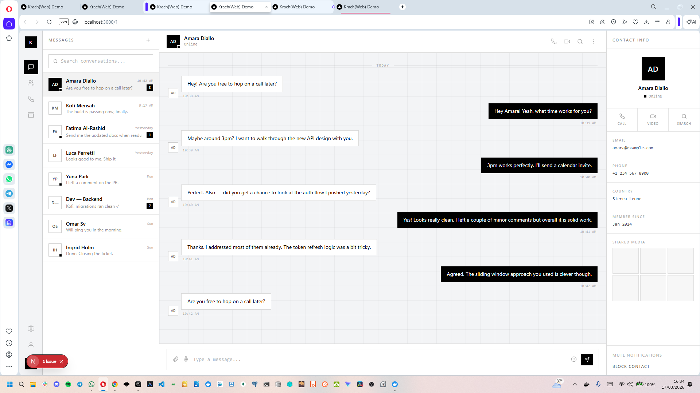
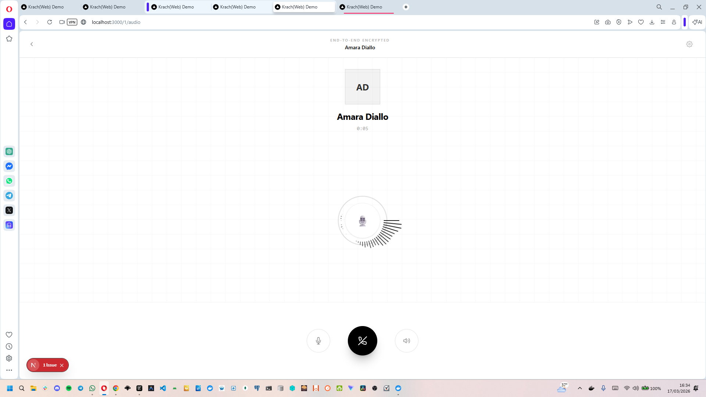
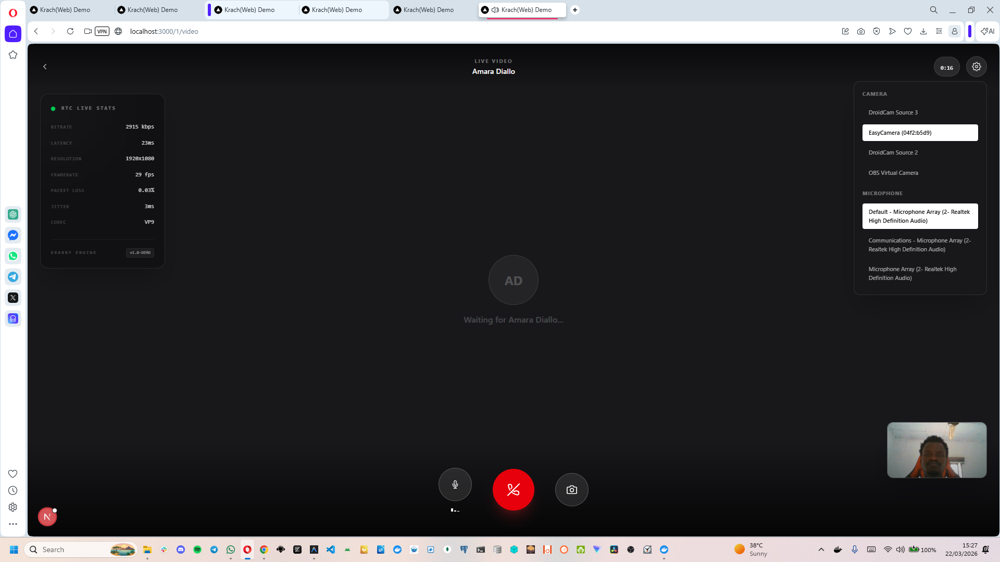

# Krabby Next.js Demo — Raw Chat API Integration

Welcome to the **Krabby Next.js Demo**! This application is a high-performance, real-time communication platform built using **Next.js 16** and **React 19**. It serves as a comprehensive reference implementation for developers looking to integrate Krabby's raw chat and calling APIs into modern web ecosystems.

This demo isn't just a basic integration; it's a full-featured communication suite designed with a "UX-first" approach, providing a polished interface for messaging - including voice, and video calls.

---

## Interface Gallery

The following screenshots demonstrate the core user flows and high-fidelity interface of the application.

### Authentication Flow
Start your journey with a secure and intuitive onboarding process.
- **Sign In Page** (`img-1.png`): A minimalist authentication portal with real-time validation.
  
- **Sign Up Page** (`img-2.png`): A comprehensive registration flow for new users, featuring a clean grid-based design.
  

### Messaging Experience
Experience lightning-fast messaging with a layout optimized for productivity.
- **Chat Dashboard** (`img-3.png`): The central hub showing all active conversations, unread message badges, and real-time online status indicators.
  
- **Active Conversation** (`img-4.png`): A deep dive into the chat interface, featuring message history, real-time typing indicators, and a detailed contact information sidebar with shared media.
  

### Real-time Communication
Integrated peer-to-peer calling powered by Krabby's specialized service implementations.
- **Audio Call** (`img-5.png`): A distraction-free voice calling interface with high-fidelity wave animations.
  
- **Video Call** (`img-6.png`): A full-screen video communication experience with integrated device management for cameras and microphones.
  

---

## Core Features

- **Instant Messaging**: Real-time text delivery with robust state synchronization.
- **High-Quality Voice Calls**: Low-latency audio communication via peer-to-peer protocols.
- **HD Video Conferencing**: Secure video calls with dynamic layout adjustments.
- **Responsive Layout**: A fluid design system that scales seamlessly from mobile handsets to ultra-wide desktop monitors.
- **State Persistence**: Global application state managed via Redux Toolkit (RTK) for a predictable data flow.
- **Mock Data Layer**: Built-in mock services allowed for immediate testing and UI development without requiring a live backend.

---

## Tech Stack

- **Framework**: [Next.js 16 (App Router)](https://nextjs.org/)
- **Library**: [React 19](https://react.dev/)
- **Styling**: [Tailwind CSS 4](https://tailwindcss.com/) — Leveraging the latest JIT engine features.
- **State Management**: [Redux Toolkit](https://redux-toolkit.js.org/)
- **Package Manager**: [Bun](https://bun.sh/)
- **Icons**: Custom-wrapped Lucide React components.

---

## Getting Started

Follow these instructions to set up the development environment on your local machine.

### 1. Prerequisites

Ensure you have [Bun](https://bun.sh/) installed (version 1.1 or higher is recommended).
```bash
# Install Bun if you haven't already
curl -fsSL https://bun.sh/install | bash
```

### 2. Installation

Clone the repository and navigate to the project directory:

```bash
cd demo_clients/web/apps/nextjs__raw_krabby_chat_api_integrations
bun install
```

### 3. Environment Configuration

...

### 4. Running the Application

Launch the development server:

```bash
bun dev
```

Visit [http://localhost:3000](http://localhost:3000) to view the application.

---

## Development Scripts

The following scripts are available in the `package.json` for development and maintenance:

| Script | Command | Description |
| :--- | :--- | :--- |
| `dev` | `next dev` | Starts the development server with hot-reloading. |
| `build` | `next build` | Compiles the application for production. |
| `start` | `next start` | Starts the production server after building. |
| `lint` | `bunx eslint .` | Runs ESLint to check for code quality issues. |
| `format` | `bunx prettier . --write` | Formats the entire codebase using Prettier. |
| `format:check` | `bunx prettier . --check` | Checks if files are properly formatted. |

---

## Project Architecture

- **`app/(routes)`**: Defines the application's page structure using Next.js file-based routing.
    - **`(auth)`**: Authentication pages (Login/Sign-up).
    - **`(chat)`**: Main messaging interface and the conversation list.
    - **`[chatId]`**: Dynamic routes for specific conversations and call screens.
- **`app/rtk-base`**: Contains the Redux store configuration and provider logic.
- **`app/components`**: Shared UI components like `ChatHeader`, `Sidebar`, and `MessageInput`.
- **`app/utils`**: Helper functions for formatting, font loading, and data manipulation.
- **`public/screenshots`**: Visual assets for documentation.

---

## Contributing and Support

Contributions are what make the open-source community such an amazing place. If you're interested in improving this demo:

1. Check out our [Main Contributing Guidelines](../../../../CONTRIBUTING.md).
2. Report bugs or request features via the [Issues](../../../../issues) tab.
3. Follow the [Code of Conduct](../../../../CODE_OF_CONDUCT.md) to maintain a healthy environment.

## License

This project is licensed under the **MIT License**. See the [LICENSE](../../../../LICENSE) file for the full text.

Cheers!!! 🍻
